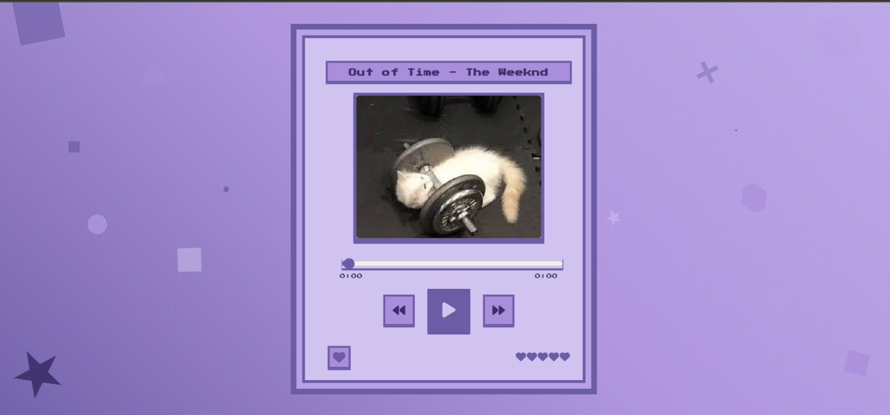

# Pixel Music Player

A retro-themed, visually rich music player built with HTML, CSS, and JavaScript. This project features a dynamic, animated background with floating geometric shapes and a pixel-art inspired UI.

## Demo



## Features

- **Retro Aesthetics:** A pixelated, colorful interface reminiscent of old-school video games.
- **Dynamic Background:** A constantly moving background with floating, rotating, and pulsing geometric shapes.
- **Music Controls:** Play, pause, next, and previous track functionality.
- **Favorite Button:** Mark your favorite track.
- **Progress Bar:** See the current track's progress and seek to different parts of the song.
- **Time Display:** Shows the current and total time of the track.
- **Keyboard Shortcuts:**
    - `Space`: Play/Pause
    - `ArrowLeft`: Previous Track
    - `ArrowRight`: Next Track
    - `F`: Favorite

## Technologies Used

- **HTML5:** For the structure of the player.
- **CSS3:** For styling and the complex animations of the background and UI elements.
- **JavaScript:** For the player's functionality and interactivity.
- **Font Awesome:** For the icons used in the player.

## How to Use

1.  **Clone the repository:**
    ```bash
    git clone https://github.com/your-username/pixel-music-player.git
    ```
2.  **Navigate to the project directory:**
    ```bash
    cd pixel-music-player
    ```
3.  **Open `index.html` in your browser.**

## Project Structure

```
.
├── assets
│   ├── Cat_demo.png
│   └── image.png
├── index.html
├── package.json
├── README.md
├── script.js
├── song.mp3
└── styles.css
```

## Customization

-   **Change the music:** Replace `song.mp3` with your own audio file. The script will automatically try to load `.mp3`, `.wav`, and `.m4a` formats.
-   **Change the artwork:** Replace `assets/image.png` with your own artwork.
-   **Customize the theme:** Modify the color variables in `styles.css` to change the player's color scheme.

## Deployment

This project is deployed on Vercel. You can view the live version here: [https://pixel-music-player-qiraxdwoo-yashchandnani07-6879s-projects.vercel.app](https://pixel-music-player-qiraxdwoo-yashchandnani07-6879s-projects.vercel.app)